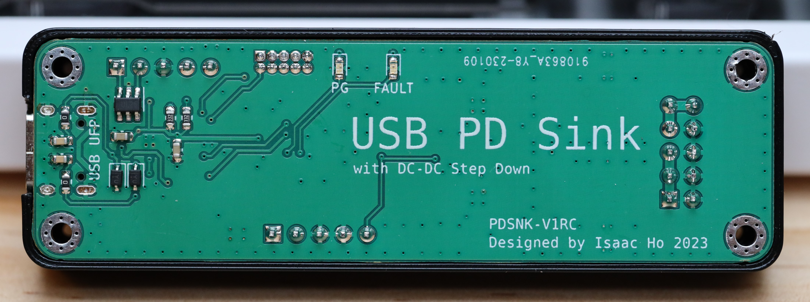

# USB-PD-StepDownSupply
A USB PD (Sink) DC-DC step-down power supply, requests 12V from PD source, provides 5V and 3.3V output.

## Components
Uses a FUSB302 and a STM32F030F4P6 for USB PD.
Two TPS62130 for step down.

## Program
A compiled firmware is provided for getting 12V from PD source. 
ST-Link, or any SWD programmer could be used for programming. 
Connect the ST-Link connector to CN1002 to download the firmware.

The firmware was modified from [manuelbl/zy12pdn-oss](https://github.com/manuelbl/zy12pdn-oss).

## Issues
This cannot be used with regular USB power supply (non-PD), or USB PD supply with 5V only power output, as TPS62130 cannot output 5V from 5V input. 

To be fixed:
- C1003 have wrong footprint size, 1206 should be used as a 0603 22uF capacitor voltage rating is too low.
- D1002 is bidirectional TVS diode, but if a unidirectional TVS diode is used, the polarity marking is on the wrong side. 
- Some trace could be bigger.

## Cost
The whole board could be made at around a few dollars.

When making 10 boards:
- FUSB302: $0.7
- STM32F030F4P6: $0.5
- TPS62130: $1*2
- HRO TYPE-C-31-M-12: $0.1
- Other components: $2 at most
- PCB: ~$10
